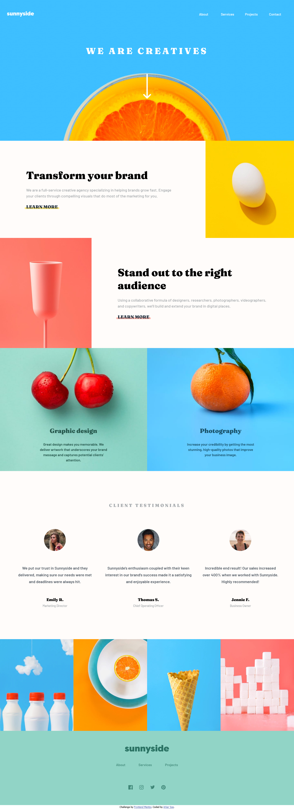

# Frontend Mentor - Sunnyside agency landing page solution

This is a solution to the [Sunnyside agency landing page challenge on Frontend Mentor](https://www.frontendmentor.io/challenges/sunnyside-agency-landing-page-7yVs3B6ef). Frontend Mentor challenges help you improve your coding skills by building realistic projects.

## Table of contents

- [Overview](#overview)
  - [The challenge](#the-challenge)
  - [Screenshot](#screenshot)
  - [Links](#links)
- [My process](#my-process)
  - [Built with](#built-with)
- [Author](#author)

## Overview

### The challenge

Users should be able to:

- View the optimal layout for the site depending on their device's screen size (but only for mobile and desktop)
- See hover states for all interactive elements on the page

### Screenshot

### Links

- Solution URL: [github](https://github.com/arkarsoeDev/fm-sunnyside-landing-page)
- Live Site URL: [gitPages](https://arkarsoedev.github.io/fm-sunnyside-landing-page/)

## My process

### Built with

- Semantic HTML5 markup
- CSS custom properties
- Flexbox
- Mobile-first workflow
- Scss

## Author

- Frontend Mentor - [@arkarsoeDev](https://www.frontendmentor.io/profile/arkarsoeDev)
- Github - [@arkarsoeDev](https://github.com/arkarsoeDev)